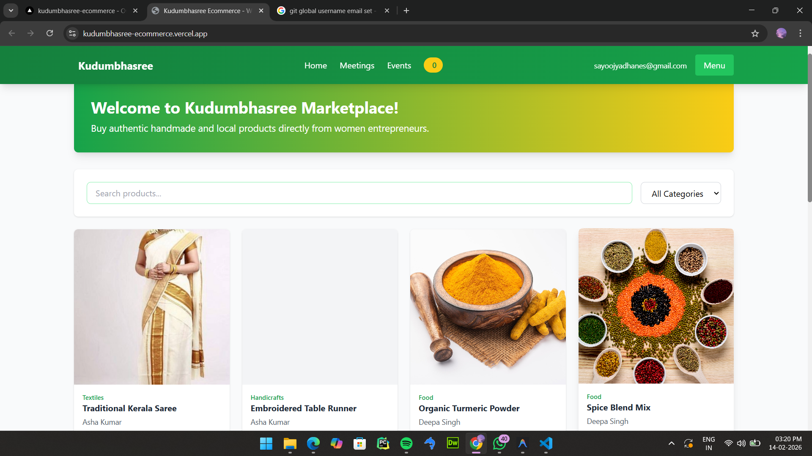
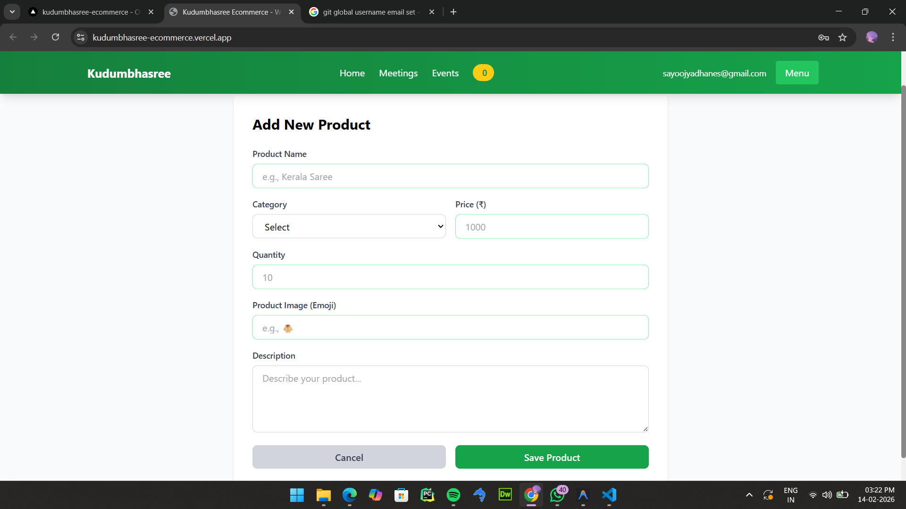
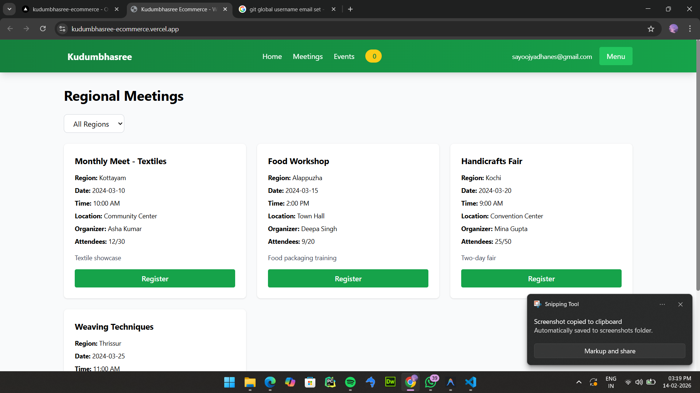
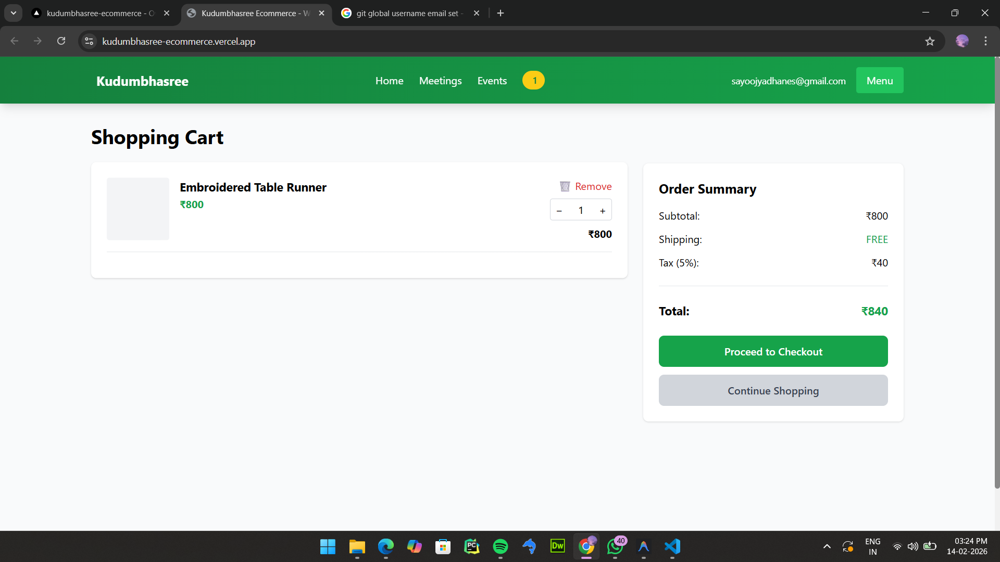

<p align="center">
  
</p>

# [kudu-commerce] 🎯

## Basic Details

### Team Name: [NS]

### Team Members
- Member 1: [Sayoojya K] - [Kannur University Campus]
- Member 2: [Nandana Sathyan] - [Kannur University Campus]

### Hosted Project Link
[https://kudumbhasree-ecommerce.vercel.app/]

### Project Description
Kudumbhasree Ecommerce is a women empowerment e-commerce platform designed to help women entrepreneurs in Kerala sell their handmade and local products online. The platform facilitates product management, online shopping, regional meeting coordination, and community building for Kudumbhasree members across Kerala.

### The Problem statement
Kudumbhasree women entrepreneurs face challenges in reaching broader markets, managing their products online, coordinating regional meetings, and building connections with buyers. There's a lack of a centralized digital platform that combines e-commerce with community management features specifically designed for rural women sellers.

### The Solution
We built a comprehensive e-commerce web platform that enables women sellers to list and manage their products, allows buyers to browse and purchase authentic local products, and facilitates regional meetings and community events. The platform is simple to use, requires no technical expertise, and works seamlessly on all devices.

---

## Technical Details

### Technologies/Components Used

**For Software:**
- Languages used: HTML5, CSS3, JavaScript (ES6+)
- Frameworks used: Tailwind CSS (via CDN)
- Libraries used: Font Awesome (for icons)
- Tools used: VS Code, Git, Browser DevTools, Local Storage API

**For Hardware:**
- Main components: Not Applicable (Software Project)
- Specifications: Not Applicable
- Tools required: Not Applicable

---

## Features

List the key features of your project:
- Feature 1: **E-Commerce Marketplace** - Women sellers can list and sell handmade products online (textiles, handicrafts, food items, home decor)
- Feature 2: **Regional Meeting Scheduler** - Schedule and manage community meetings across different regions (Kottayam, Alappuzha, Kochi, Thrissur)
- Feature 3: **Social Events Showcase** - View and manage social events conducted by Kudumbhasree organization
- Feature 4: **Shopping Cart & Checkout** - Complete e-commerce flow with cart management, order summary, and checkout process
- Feature 5: **Product Search & Filtering** - Search products by name/description and filter by category
- Feature 6: **Dual User Roles** - Separate dashboards and features for Sellers (product management) and Buyers (shopping)
- Feature 7: **Admin Dashboard** - Comprehensive admin panel for managing products, events, meetings, and sellers
- Feature 8: **Order History** - Track all purchases and view order status
- Feature 9: **Responsive Design** - Works seamlessly on desktop, tablet, and mobile devices
- Feature 10: **No Backend Required** - Uses browser local storage for data persistence

---

## Implementation

### For Software:

#### Installation
```bash
# No installation required! Just clone or download the project
git clone <your-repo-url>
cd kudumbhasree-ecommerce

# Or simply download the ZIP file and extract it
```

#### Run
```bash
# Method 1: Simply open index.html in your browser
# Double-click index.html or right-click and select "Open with Browser"

# Method 2: Run a local server (recommended)
# Using Python 3:
python -m http.server 8000

# Using Node.js:
npx http-server -p 8000

# Then open http://localhost:8000 in your browser
```

---

## Project Documentation

### For Software:

#### Screenshots (Add at least 3)


*Home page showing the product marketplace with search and category filters*


*Seller dashboard displaying product management and statistics*


*Regional meetings page showing scheduled community meetings across Kerala*


*Shopping cart with order summary and checkout functionality*

#### Diagrams

**Application Workflow:**

```
User Journey Flow:

Login/Signup → Select Role (Buyer/Seller/Admin) → Dashboard

Buyer Flow:
Dashboard → Browse Products → Search/Filter → View Details → Add to Cart → Checkout → Order Confirmation

Seller Flow:
Dashboard → View Statistics → Add/Edit Products → Schedule Meetings → Manage Inventory

Admin Flow:
Dashboard → Manage All Products → Add Events → Manage Meetings → View Statistics
```

**System Architecture:**

```
Frontend (HTML/CSS/JavaScript)
    ↓
Tailwind CSS (Styling)
    ↓
Local Storage API (Data Persistence)
    ↓
User Data | Cart Data | Products | Orders | Meetings
```

---

## Additional Documentation

### Project Structure

```
kudumbhasree-ecommerce/
├── index.html              # Main HTML file with all pages
├── css/
│   └── style.css          # Custom styling and animations
├── js/
│   ├── app.js             # Application logic and functions
│   └── data.js            # Dummy data (sellers, products, meetings)
├── assets/                 # Folder for images and resources
├── public/                 # Screenshots and public assets
├── README.md               # This file - complete project documentation
```

### User Roles & Permissions

**Buyer Role:**
- Browse and search all products
- View product details with seller information
- Add products to cart and checkout
- View order history
- Register for regional meetings
- Save favorite products

**Seller Role:**
- All buyer features
- Add, edit, and delete own products
- View seller dashboard with statistics
- Schedule regional meetings
- Manage product inventory

**Admin Role:**
- Manage all products from all sellers
- Add and manage social events
- View all regional meetings
- Access comprehensive statistics
- Manage platform-wide settings

### Demo Data Included

**4 Sample Sellers:**
- Asha Kumar (Kottayam) - Textile Artisan
- Deepa Singh (Alappuzha) - Food Products Expert
- Mina Gupta (Kochi) - Handicraft Maker
- Priya Nair (Thrissur) - Textile Designer

**15 Sample Products:**
- Traditional Kerala Sarees
- Handicrafts (bowls, wall hangings, pen stands)
- Organic Food Items (turmeric, spices, coconut oil)
- Home Decor (door mats, cushions)
- Textiles (scarves, fabric, table runners)

**5 Regional Meetings:**
- Monthly community meets
- Training workshops
- Handicrafts fairs
- Skill-sharing sessions

**Demo Login Credentials:**
- Email: `demo@kudumbhasree.com`
- Password: `password123`
- Can be used for both Buyer and Seller roles

---

## Project Demo

### Video
[Add your demo video link here - YouTube, Google Drive, etc.]

*The video demonstrates the complete user journey including:*
- User authentication (login/signup as buyer and seller)
- Product browsing with search and filters
- Shopping cart and checkout process
- Seller dashboard and product management
- Regional meetings scheduling
- Admin dashboard features
- Responsive design on different devices

### Live Demo
- **Local Demo**: Open `index.html` in your browser or run `python -m http.server 8000` and visit `http://localhost:8000`
- **Test Credentials**: demo@kudumbhasree.com / password123

### Key Features Demo
1. **Authentication System**: Try logging in as both Buyer and Seller to see different dashboards
2. **Product Management**: Add, edit, and delete products as a seller
3. **Shopping Experience**: Browse 15 pre-loaded products, add to cart, and complete checkout
4. **Meeting Scheduler**: View and schedule regional meetings
5. **Admin Panel**: Login as admin to manage all products, events, and meetings

---

## AI Tools Used (Optional - For Transparency Bonus)

**Tool Used:** Vs Code / Claude AI

**Purpose:** Development assistance and code generation
- Generated initial HTML structure and Tailwind CSS styling
- Created JavaScript logic for authentication and cart management
- Developed product management CRUD operations
- Generated dummy data for sellers, products, and meetings
- Code review and debugging assistance
- Documentation writing support

**Key Prompts Used:**
- "Draft a women empowerment e-commerce platform for Kudumbhasree with HTML, CSS, and JavaScript"
- "Implement shopping cart functionality with local storage persistence"
- "Add seller dashboard with product management features"
- "Create regional meeting scheduler for different regions in Kerala"
- "Implement dual authentication system for buyers and sellers"

**Percentage of AI-generated code:** Approximately 70-80%

**Human Contributions:**
- Project concept and feature planning
- User experience design decisions  
- Integration and testing of all features
- Customization for Kudumbhasree-specific requirements
- Regional data (Kerala cities, local products)
- Documentation review and refinement
- Bug fixes and optimization

*Note: Proper documentation of AI usage demonstrates transparency and earns bonus points in evaluation!*

---

## Team Contributions

- **Sayoojya K**: Frontend development, UI/UX design, Product management features, Testing and debugging
- **Nandana Sathyan**: Backend logic implementation, Shopping cart functionality, Regional meetings system, Documentation

---

## License

This project is licensed under the MIT License.

**MIT License:**
- ✅ Permissive and widely used
- ✅ Allows commercial and private use
- ✅ Allows modification and distribution
- ✅ Simple and business-friendly

**Other Common License Options:**
- Apache 2.0 (Permissive with patent grant)
- GPL v3 (Copyleft, requires derivative works to be open source)

---

Made with ❤️ at TinkerHub

**Project Credits:**
- Team: NS (Sayoojya K & Nandana Sathyan)
- Institution: Kannur University Campus
- Purpose: Women Empowerment through Technology
- Target: Kudumbhasree Community in Kerala

**Contact & Support:**
- For queries: Contact team members
- Issues: Report via project repository